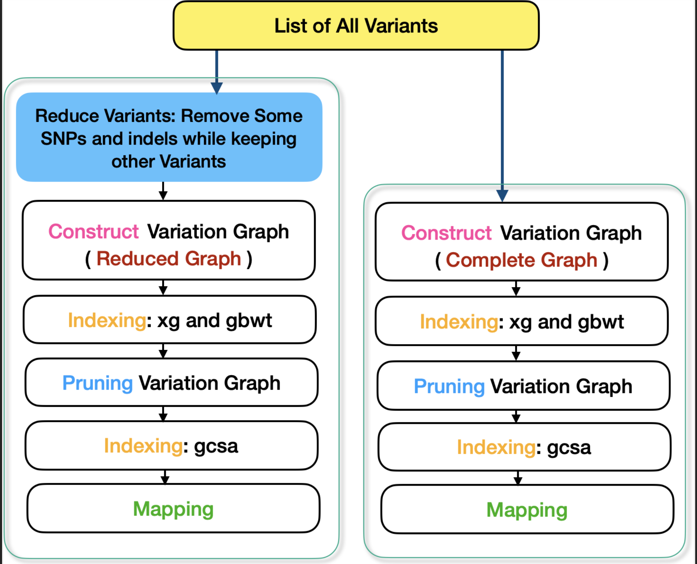

# RedMap

## Reduced Map:

## Dependencies
- gcc (with C++20 support)
- Boost Graph Library
- Python (3+)
- [samtools](https://vcftools.github.io/)
- [bcftools](https://samtools.github.io/bcftools/)
- [hged](https://github.com/NedaTavakoli/hged_cpp)
- [vg](https://github.com/vgteam/vg)

## Variant Impact Evaluation
This repositioru is used to show to impact of variant reduction on read-to-graph mappers, here vg toolkit.

We conducted an evaluation to understand how the reduction of variants affects the performance and accuracy of read-to-graph mappers. In this study, we employed the `vg` toolkit as our selected read-to-graph mapper.

### Simulating Read Sets

To simulate read sets, we generated reads from haplotype paths within the complete variation graph, taking into account realistic error rates and read lengths. We achieved this simulation using the `vg sim` option.

Specifically, we simulated a total of 100,160 reads, each with a length of 1,000 base pairs. These simulated reads were subject to a substitution error rate of 2.4% and an indel error rate of 10%. To obtain the true alignment paths in GAM format, we included the `-a` option in the `vg sim` command.

### Scenario Evaluation

We assessed the impact of reducing variants on read-to-graph mappers through two scenarios:

1. **Scenario 1: Complete Variation Graph**

   In this scenario, we mapped simulated reads onto the complete variation graph. Figure here provides an overview of the overall pipeline for this scenario. The pipeline includes graph construction, the creation of xg and gbwt indices, graph pruning, building the GCSA index, and the mapping process.

2. **Scenario 2: Reduced Variation Graph**

   Contrasting the first scenario, we initiated the mapping process with a reduced variation graph. The reduced variation graph was obtained by applying our algorithm to reduce the number of SNPs and Indel variants while preserving other types of variants.

We utilized `vg construct` with the `-a` option to generate the variation graph, including all alternative paths. Each allele of every variant is represented by a path, which is essential for constructing the GBWT index required for indexing haplotype paths within the graph.

In practice, the `vg` toolkit necessitates two distinct representations of a graph for read mapping:
- **XG**: A succinct graph representation.
- **GCSA (Graph Compressed Sequence Alignment)**: A k-mer based index.

To create these representations, we used `vg index`. Pruning the graph offers the advantage of reducing the size of the GCSA index, which proves advantageous for both storage capacity and memory usage during alignment.

Finally, we applied `vg map` to map the list of simulated reads on both the complete variation graph and the reduced variation graph.
